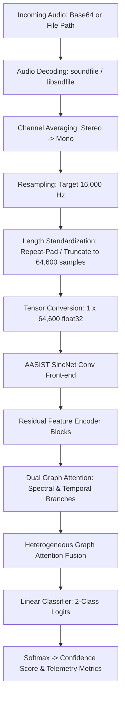

# AASIST Audio Deepfake Detector Microservice

Part of **AEGIS** (Agentic, Edge-optimized, explainable deepfake verIfication System)  
**Layer B: Hardware-Aware Inference Engine & Detector Microservices**

---

## 1. Overview

This microservice wraps the **AASIST** (*Audio Anti-Spoofing using Integrated Spectro-Temporal Graph Attention Networks*) deep learning model as an independent, containerized FastAPI microservice. It detects voice cloning, text-to-speech (TTS) synthesis, and voice conversion (VC) artifacts in audio streams and files.

- **Paper**: [AASIST: Audio Anti-Spoofing using Integrated Spectro-Temporal Graph Attention Networks](https://arxiv.org/abs/2110.01200) (Jung et al., NAVER Corp / Clova AI)
- **Baseline Performance**: Equal Error Rate (EER) of **0.83%** and min t-DCF of **0.0275** on the ASVspoof 2019 Logical Access (LA) evaluation benchmark.
- **Model Parameters**: ~297K parameters (compact, CPU & Edge friendly).

---

## 2. Architecture & Pipeline



### Preprocessing Pipeline
1. **Decoding**: Ingests either Base64-encoded audio (supporting WAV, FLAC, MP3, OGG) or internal Docker file paths.
2. **Channel Downmix**: Converts multi-channel audio to mono by channel averaging.
3. **Resampling**: Polyphase resampling to standard **16,000 Hz** via `torchaudio`.
4. **Length Standardization**: Exactly **64,600 samples** (~4.0375 seconds). Shorter clips are cyclic-repeated, longer clips are truncated.

---

## 3. API Contract Specifications

Strictly adheres to [`shared/json-api-contracts-schema/`](../../shared/json-api-contracts-schema/).

### 3.1 `POST /detect`
Performs synthetic audio inference.

#### Request Schema
```json
{
  "job_id": "c9bf9e57-1685-4c89-bafb-ff5af830be8a",
  "modality": "audio",
  "payload": "<BASE64_ENCODED_AUDIO_OR_ABSOLUTE_FILE_PATH>"
}
```

#### Response Schema
```json
{
  "job_id": "c9bf9e57-1685-4c89-bafb-ff5af830be8a",
  "confidence": 0.9984,
  "raw_score": 4.1205,
  "latency_ms": 38,
  "ram_usage_mb": 142.50,
  "vram_usage_mb": null,
  "model_version": "aasist-v1.0",
  "evidence": {
    "claim": "High probability of synthetic/cloned audio detected; severe spectral-temporal graph attention irregularities observed.",
    "flags": [
      "high_spoof_confidence",
      "voice_cloning_suspected",
      "graph_spectral_anomaly"
    ]
  }
}
```
*Field definitions:*
- `confidence`: Normalized float `[0.0, 1.0]`. **0.0 = Authentic (bonafide human)**, **1.0 = Synthetic/Deepfake**.
- `raw_score`: Unnormalized spoof logit from PyTorch model output.
- `latency_ms`: Measured inference duration in milliseconds.
- `ram_usage_mb` / `vram_usage_mb`: Peak memory telemetry for the Orchestrator.
- `evidence`: Contextual reasoning utilized by the Layer C Debate Agent.

### 3.2 `GET /health`
Liveness and readiness probe for Docker / Orchestrator.

#### Response
```json
{
  "status": "healthy",
  "model_loaded": true,
  "model_version": "aasist-v1.0",
  "device": "cpu"
}
```

---

## 4. Running the Microservice

### Via Docker Compose (Recommended)
From project root:
```bash
# Build the AASIST container
docker compose build detector_aasist

# Start the service
docker compose up -d detector_aasist

# Check logs
docker compose logs -f detector_aasist
```

### Direct Local Testing (FastAPI / Uvicorn)
```bash
# In an activated Python 3.10+ environment:
pip install -r detectors/aasist/requirements.txt
cd detectors/aasist
uvicorn app:app --host 0.0.0.0 --port 8000 --reload
```

---

## 5. Verification & Testing

The microservice includes automated unit tests, schema validation, and a 50-sample sanity check benchmark against authentic and spoofed audio from the ASVspoof 2019 dataset:

```bash
# Run unit & API contract tests inside Docker
docker compose exec detector_aasist pytest tests/test_preprocessing.py tests/test_api.py -v

# Run 50-sample sanity check benchmark
docker compose exec detector_aasist pytest tests/test_sanity.py -v -s
```

### Example `curl` Smoke Tests

**Health Check:**
```bash
curl http://localhost:8002/health
```

**Detect via Base64 Audio:**
```bash
curl -X POST http://localhost:8002/detect \
  -H "Content-Type: application/json" \
  -d '{
    "job_id": "test-job-001",
    "modality": "audio",
    "payload": "'$(base64 -w 0 tests/fixtures/spoof_SS_1_p229_c0001.wav)'"
  }'
```

**Detect via Gateway Proxy (Port 8081):**
```bash
curl -X POST http://localhost:8081/api/audio \
  -H "X-Internal-Token: ${INTERNAL_API_KEY}" \
  -H "Content-Type: application/json" \
  -d '{
    "job_id": "gateway-job-001",
    "modality": "audio",
    "payload": "..."
  }'
```
