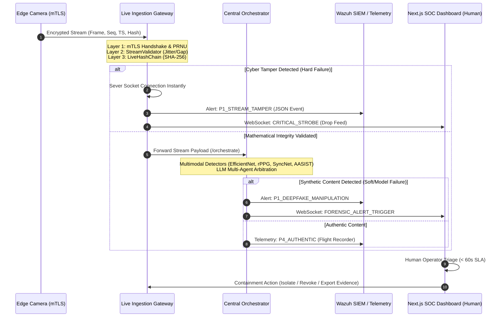

# 🚨 AEGIS Incident Response & Escalation Workflow
**Standard Operating Procedure (SOP) & Architecture Specification**  
**Document ID:** `AEGIS-SOP-IR-001`    
**Compliance Standards:** NIST SP 800-61 Rev. 2, ISO/IEC 27037 (Digital Evidence Preservation)  
**Project:** AEGIS – The Shield Against Synthetic Media (ECU 2026/2027)  

---

## 1. Executive Summary & Purpose

In live surveillance and critical infrastructure protection, detecting synthetic media or video stream manipulation is ineffective without a hardened, deterministic mechanism to alert human operators and trigger incident containment.

This specification documents the **end-to-end incident response, telemetry routing, and escalation lifecycle** for the AEGIS platform:
1. **Anomaly Detection Triggers & Thresholds:** Defines mathematical and model confidence boundaries separating benign artifacts from active cyber attacks.
2. **SIEM / SOC Routing Architecture:** Explains how alerts traverse from the ingestion edge and orchestrator into enterprise SIEM destinations (Wazuh, Syslog) and the operator dashboard.
3. **Actionable Alert Schema:** Establishes a strictly typed JSON contract containing all forensic context required for human triage.
4. **Human-in-the-Loop Escalation Playbook:** Specifies SLAs, operator triage procedures, automated containment controls, and chain-of-custody preservation.

---

## 2. End-to-End System Architecture & Telemetry Pipeline

The incident pipeline operates across three tiers: Edge Ingestion & Forensics, Central Orchestration & Threat Intelligence, and the SOC / SIEM Security Tier.



---

## 3. Threat Tiers, Thresholds & Alert Triggers

AEGIS adopts a **dual-engine threshold strategy**:
- **Deterministic Hard Triggers (Cyber/Physical Layer):** Non-negotiable cryptographic or hardware sensor failures that trigger immediate feed disconnection without model inference.
- **Probabilistic Soft Triggers (AI/Deepfake Layer):** Aggregated multi-detector anomaly scores evaluated against calibrated operational ceilings.

### 3.1 Severity Classification Matrix

| Severity Level | Trigger Condition | Anomaly Score ($S$) | Primary Destination | Response SLA | Automated Action |
| :--- | :--- | :---: | :--- | :---: | :--- |
| **P1 — Critical Attack** | • Broken SHA-256 Hash Chain<br>• PRNU Sensor Noise PCE $< 50.0$<br>• Rogue / Unsigned mTLS Cert<br>• Model Aggregated Score $\ge 0.70$ | $S \ge 0.70$ or Hard Fail | • Wazuh SIEM (`Rule 100201`)<br>• SOC Dashboard (Red Strobe)<br>• PagerDuty / Webhook | **Immediate (< 60s)** | **Socket severed instantly**; live feed replaced by hold slate; tamper segment locked in SQLite vault. |
| **P2 — High Suspect** | • Deepfake confidence $0.50 \le S < 0.70$<br>• StreamValidator sequence gap $> 5$<br>• SyncNet lip-sync divergence | $0.50 \le S < 0.70$ | • Wazuh SIEM (`Rule 100202`)<br>• SOC Dashboard (Amber Strobe) | **< 5 Minutes** | Feed flagged with bounding-box risk overlay; secondary detector pass initiated. |
| **P3 — Low / Warning** | • Ambient lighting drop (rPPG attenuation)<br>• Jitter variance outside nominal 33ms<br>• Score $0.35 \le S < 0.50$ | $0.35 \le S < 0.50$ | • Telemetry Prometheus / SQLite<br>• Yellow Banner on Dashboard | **< 15 Minutes** | Sensor health diagnostics pinged; rPPG weights attenuated. |
| **P4 — Informational** | • Full cryptographic verification passed<br>• Model Aggregated Score $< 0.35$ | $S < 0.35$ | • `flight_recorder.db`<br>• Prometheus metrics (`/metrics`) | None | Logged to immutable audit trail. |

---

## 4. SIEM / SOC Routing Destinations

Detected anomalies are simultaneously dispatched across three channels:

1. **Wazuh SIEM (Enterprise SOC Monitoring):**
   - The Gateway and Orchestrator stream structured JSON alerts to the local Wazuh agent socket (`/var/ossec/queue/sockets/queue` or Syslog port `514/UDP`).
   - Mapped into Wazuh custom rules (`local_rules.xml` IDs `100200–100210`).
   - Indexed into OpenSearch / Kibana for institutional compliance and correlation with broader perimeter intrusion events.

2. **AEGIS Live Operator Dashboard (Next.js 15 UI):**
   - Broadcast via secure WebSockets (`wss://gateway:8443/ws/alerts`).
   - Renders the high-visibility **Emergency Strobe Banner**, triggers audio alerting (if enabled), updates the real-time SVG risk trajectory graph, and opens the **Forensic Evidence Drawer**.

3. **External Webhook / Ticketing API:**
   - POST dispatch to enterprise webhooks (Splunk, PagerDuty, Jira Service Management, or Matrix/Telegram bots) with signed SHA-256 payloads for external escalation.

---

## 5. Actionable Alert Schema Specification

For an incident alert to be actionable by a SOC operator, it must include **who, what, where, when, and the mathematical proof**. Bare scores without evidence are strictly prohibited by AEGIS design guidelines.

### 5.1 JSON Alert Contract Schema

```json
{
  "$schema": "https://json-schema.org/draft/2020-12/schema",
  "title": "AEGIS_Incident_Alert",
  "type": "object",
  "required": [
    "alert_id",
    "timestamp_iso",
    "severity",
    "camera_metadata",
    "threat_classification",
    "anomaly_score",
    "evidence_bundle",
    "recommended_actions"
  ],
  "properties": {
    "alert_id": { "type": "string", "format": "uuid" },
    "timestamp_iso": { "type": "string", "format": "date-time" },
    "severity": { "type": "string", "enum": ["P1_CRITICAL", "P2_HIGH", "P3_WARNING", "P4_INFO"] },
    "camera_metadata": {
      "type": "object",
      "required": ["camera_id", "ip_address", "location", "certificate_fingerprint"],
      "properties": {
        "camera_id": { "type": "string" },
        "ip_address": { "type": "string" },
        "location": { "type": "string" },
        "certificate_fingerprint": { "type": "string" }
      }
    },
    "threat_classification": {
      "type": "string",
      "enum": [
        "CRYPTOGRAPHIC_HASH_MISMATCH",
        "PRNU_SENSOR_MISMATCH",
        "STREAM_REPLAY_ATTACK",
        "STREAM_SEQUENCE_GAP",
        "ROGUE_CREDENTIAL_ATTEMPT",
        "NEURAL_FACIAL_SYNTHESIS",
        "AUDIO_VOICE_CLONING",
        "AUDIO_VISUAL_LIP_SYNC_DESYNC"
      ]
    },
    "anomaly_score": { "type": "number", "minimum": 0.0, "maximum": 1.0 },
    "evidence_bundle": {
      "type": "object",
      "required": ["forensic_hash", "frame_sequence_range", "technical_detail"],
      "properties": {
        "forensic_hash": { "type": "string" },
        "frame_sequence_range": { "type": "array", "items": { "type": "integer" } },
        "pce_score": { "type": "number" },
        "broken_at_sequence": { "type": "integer" },
        "model_contributions": { "type": "object" },
        "technical_detail": { "type": "string" },
        "snapshot_uri": { "type": "string" }
      }
    },
    "recommended_actions": {
      "type": "array",
      "items": { "type": "string" }
    }
  }
}
```

### 5.2 Real-World Incident Payload Examples

#### Example 1: Physical Camera PRNU Mismatch (Sensor Spoofing)
```json
{
  "alert_id": "8f3b618c-491a-4d22-9cb8-b57f00fa32b1",
  "timestamp_iso": "2026-10-10T12:24:19.452Z",
  "severity": "P1_CRITICAL",
  "camera_metadata": {
    "camera_id": "cam-gate-04",
    "ip_address": "192.168.10.45",
    "location": "North Perimeter Gate",
    "certificate_fingerprint": "SHA256:7e8b91a24d55..."
  },
  "threat_classification": "PRNU_SENSOR_MISMATCH",
  "anomaly_score": 0.98,
  "evidence_bundle": {
    "forensic_hash": "e3b0c44298fc1c149afbf4c8996fb92427ae41e4649b934ca495991b7852b855",
    "frame_sequence_range": [1024, 1054],
    "pce_score": 15.54,
    "pce_threshold": 50.0,
    "broken_at_sequence": 1024,
    "technical_detail": "Photo-Response Non-Uniformity residual failed correlation with enrolled Sony IMX385 sensor baseline. PCE dropped to 15.54 (expected > 100.0). Video feed originates from a foreign physical device.",
    "snapshot_uri": "vault://evidence/20261010/cam-gate-04_seq1024_forensic.mkv"
  },
  "recommended_actions": [
    "Sever live ingestion socket immediately",
    "Dispatch physical security to North Perimeter Gate",
    "Seal sequence 1020-1060 in SQLite forensic flight recorder"
  ]
}
```

#### Example 2: AI Neural Face Swap (Deepfake Manipulation)
```json
{
  "alert_id": "4a18cd90-d831-4822-b501-c88f997a119e",
  "timestamp_iso": "2026-10-10T12:25:03.118Z",
  "severity": "P1_CRITICAL",
  "camera_metadata": {
    "camera_id": "cam-briefing-room",
    "ip_address": "10.0.4.12",
    "location": "Executive Briefing Room",
    "certificate_fingerprint": "SHA256:4b9211c4..."
  },
  "threat_classification": "NEURAL_FACIAL_SYNTHESIS",
  "anomaly_score": 0.892,
  "evidence_bundle": {
    "forensic_hash": "8f835b7194...77bc",
    "frame_sequence_range": [450, 520],
    "model_contributions": {
      "video-classifier (EfficientNet-B0)": 0.941,
      "rppg (CHROM Physiological)": 0.825,
      "syncnet (Audio-Visual)": 0.860
    },
    "technical_detail": "EfficientNet-B0 detected blending boundaries at facial perimeter; CHROM rPPG detected absent physiological blood volume pulse in forehead ROI; SyncNet detected 80ms lip-sync lag.",
    "snapshot_uri": "vault://evidence/20261010/cam-briefing_seq450_crop.png"
  },
  "recommended_actions": [
    "Trigger visual strobe on SOC Operator Station",
    "Hold active video stream on last verified authentic frame",
    "Notify Watch Commander via PagerDuty"
  ]
}
```

---

## 6. Standard Operating Procedures (SOP) & Escalation Playbook

```
[ALERT GENERATION] 
       │
       ▼
┌─────────────────────────────────┐
│ TIER 1: SOC Operator (0-60s)    │
│ • Confirm Alert in Dashboard   │
│ • Inspect Snapshot & PCE Score  │
│ • Acknowledge Strobe Banner     │
└──────────────┬──────────────────┘
               │
        Is Verified Threat?
        ├──────────── NO ──► Mark False Positive / Adjust Baseline
        │
       YES
        │
        ▼
┌──────────────────────────────────────────────┐
│ TIER 2: Forensics Specialist (1-5 min)       │
│ • Validate Hash Chain in SQLite DB           │
│ • Verify PRNU Sensor Residual in Python Tool │
│ • Review AI Model Multi-Layer Evidence       │
│ • Trigger Quarantine of Feed                 │
└──────────────┬───────────────────────────────┘
               │
               ▼
┌──────────────────────────────────────────────┐
│ TIER 3: Incident Commander & Legal (5+ min)  │
│ • Revoke Camera Certificate (x509 CRL/OCSP)  │
│ • Export Signed Chain-of-Evidence Report     │
│ • Dispatch Field Response / Law Enforcement  │
└──────────────────────────────────────────────┘
```

### 6.1 Phase 1: Detection & Triage (< 60 Seconds)
1. **Operator Alert Notification:** The SOC operator is alerted by the persistent high-priority strobe banner and audible buzzer on the Next.js web application.
2. **Visual Inspection:** Operator clicks **Review Evidence** to open the forensic drawer.
3. **PCE & Hash Verification:**
   - If `CRYPTOGRAPHIC_HASH_MISMATCH` or `PRNU_SENSOR_MISMATCH`: The video stream has been intercepted or injected at the transport/sensor layer.
   - If `NEURAL_FACIAL_SYNTHESIS`: The video is deepfaked despite valid transport signatures.
4. **Action:** Click **Acknowledge Alert**. If confirmed malicious, press **Lockdown Camera Feed**.

### 6.2 Phase 2: Containment & Evidence Preservation (< 5 Minutes)
1. **Automated Feed Severance:** The Ingestion Gateway drops the TCP/TLS socket to prevent poisoned feed presentation.
2. **Failover Execution:** Downstream monitors switch to an informational standby screen (*"Stream Suspended: Forensics Verification in Progress"*).
3. **Cryptographic Sealing (ISO/IEC 27037):**
   - The raw video segment (30 seconds pre-incident, 30 seconds post-incident) is copied to the write-once SQLite flight recorder (`flight_recorder.db`).
   - A cryptographic manifest is computed: $\text{SHA-256}(\text{frames}) \mathbin{\Vert} \text{Timestamp} \mathbin{\Vert} \text{Camera Cert Serial}$.
   - The bundle is digitally signed with the AEGIS System Private Key to produce a tamper-evident courtroom exhibit.

### 6.3 Phase 3: Eradication, Recovery & Post-Mortem
1. **Device Credential Revocation:** If credential forgery or rogue certificates were attempted, the serial number is added to the gateway revocation list.
2. **Camera Sensor Recalibration:** If PRNU degradation was caused by sensor hardware aging or lens obstruction, an authorized engineer re-enrolls the camera sensor baseline.
3. **Post-Incident Review:** Document the incident in `pen_test_log.md` and `docs/failure_notes.md` to retrain/refine model fusion thresholds.

---

## 7. Operational Roles & Contact Escalation

| Role | Primary Responsibility | Contact Trigger |
| :--- | :--- | :--- |
| **SOC Tier 1 Operator** | 24/7 Monitoring, Alert Acknowledgment, Initial Feed Freeze | Automatic UI Strobe |
| **Forensic Specialist (Yassin)** | PRNU extraction validation, hash-chain mathematical analysis | P1 Hard Failure |
| **Transport Security Lead (Ahmed)** | mTLS gateway certificate authority, Nginx reverse proxy | Rogue Credentials / DoS |
| **SIEM / Wazuh Admin (Omar)** | Wazuh rule tuning, incident ticketing correlation | P1/P2 Alerts |
| **Faculty Supervisor (Dr. Amr)** | Milestone defense review, executive summary briefing | Weekly Incident Summary |

---
*Authorized by AEGIS Cybersecurity & AI Architecture Team.*  
*Next Review Date: November 2026.*
