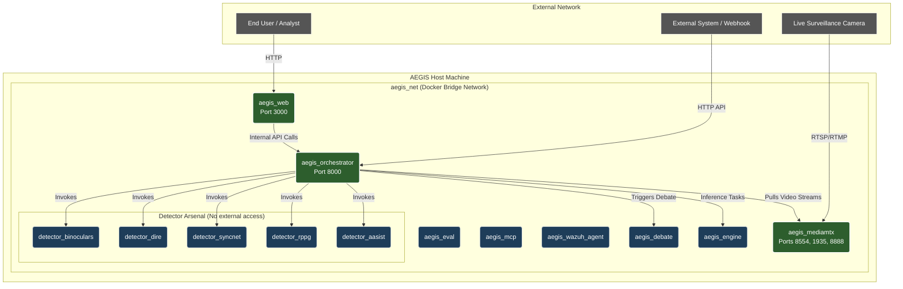

# AEGIS Docker Infrastructure Guide

This document explains the container architecture and networking setup for the AEGIS project, defined in our root `docker-compose.yml`.

## 1. Architecture Diagram

The following diagram illustrates how our services connect, which ones are exposed to the outside world, and how they communicate internally over the private Docker network.

## 2. The Network: `aegis_net`
We use a custom Docker bridge network called `aegis_net`. 
Every container is attached to this network. This provides two massive benefits:
1. **Service Discovery:** Services can talk to each other just by using their container name. The orchestrator can simply send a request to `http://detector_rppg:80` without needing to know IP addresses.
2. **Security:** By default, no container on this network can be accessed from your local computer or the internet. They are completely isolated.

## 3. Exposed Ports (The "Gates")
We only expose ports for the absolute minimum number of services required to interact with the system:
* **Port 3000 (`aegis_web`):** The frontend UI.
* **Port 8000 (`aegis_orchestrator`):** The main API Gateway for the system.
* **Ports 8554, 1935, 8888 (`aegis_mediamtx`):** For ingesting live surveillance video streams.

## 4. The Secure Core (Internal Only)
The Engine, Debate agents, Eval framework, and **all of the Detectors** are strictly internal. 
An attacker cannot bypass the Orchestrator to probe a detector directly because the detectors have no ports exposed to the host machine. The Orchestrator acts as the system's shield, validating `INTERNAL_API_KEY`s before passing tasks deeper into the network.

## 5. What are "Stub Containers"?
If you run `docker compose up -d` today, you will see all these containers start up perfectly, but they don't contain any real Python code yet. 
They are configured with `command: tail -f /dev/null`, which tells the Linux container to simply stay awake. We do this to build the skeleton of the project. It allows the Frontend and Orchestration teams to immediately start writing networking code against live endpoints, without waiting for the Machine Learning team to finish building the models.
